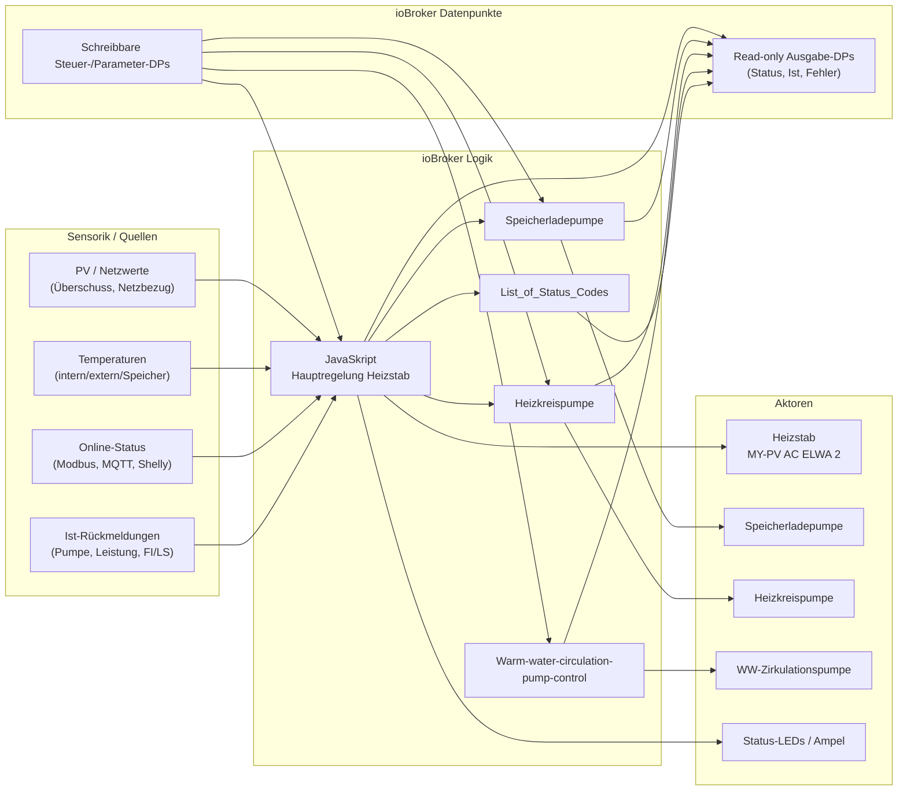

# 🔥 Power-to-Heat

**PV-Überschuss intelligent in Wärme umwandeln** – mit klaren Betriebsmodi, Sicherheitslogik und modularen ioBroker-Skripten.

Dieses Repository beschreibt eine ioBroker-Automatisierung, die einen **MY-PV AC ELWA 2 Heizstab** sowie mehrere Pumpen rund um Warmwasser, Pufferspeicher und Heizkreis koordiniert. Die Skripte sind bewusst modular aufgebaut: Das Hauptskript entscheidet über Heizstab-Leistung, Betriebsmodus, Sicherheit und Status; die Unterskripte steuern die jeweiligen Pumpen und melden Zustände zurück.

> **Wichtiger Hinweis:** Datenpunkte, Grenzwerte und Zeiten sind an die konkrete Anlage angepasst. Vor produktiver Nutzung müssen alle ioBroker-Datenpunkte, Shelly-/Modbus-/MQTT-Pfade, Temperaturfühler und Aktoren geprüft und ggf. im Kopfbereich der Skripte geändert werden.

📘 **Anwender-Wiki:** Eine GitHub-Wiki-taugliche Bedien- und Anlagenbeschreibung ohne Code-Erklärungen liegt in [`WIKI.md`](WIKI.md).

---

## 🎯 Ziel des Projekts

Das System nutzt primär **überschüssigen PV-Strom**, um Wärme im Pufferspeicher bzw. Warmwassersystem zu speichern. Dadurch kann der Heizkessel – besonders in der warmen Jahreszeit – entlastet oder vermieden werden.

Die Automatisierung übernimmt dabei:

- Erkennung von PV-Überschuss und Netzbezug
- Leistungsregelung des Heizstabs mit Rampe und Kalibrierkennlinie
- Warmwasser-Sicherstellung bei zu niedriger Speichertemperatur
- Schutz vor Übertemperatur, FI/LS-Ausfall, Offline-Geräten und Leistungsabweichungen
- Koordination von Speicherladepumpe, Heizkreispumpe und Warmwasser-Zirkulationspumpe
- Statusausgaben, Fehlercodes, Ampel-LEDs und JSON-Log für Diagnose

---

## 🧩 Projekt-Komponenten

| Datei | Rolle | Kurzbeschreibung |
| --- | --- | --- |
| `JavaSkript` | Hauptskript | Zentrale Heizstab-Regelung inkl. Betriebsmodi, PV-Regelung, WW-Sicherstellung, PWM, Ampel, Kalibrierung, Selbsttest und Fehlerlogik. |
| `Speicherladepumpe` | Unterskript | Steuert die Speicherladepumpe über GPIO17/GPIO18 abhängig von Betriebsmodus, Temperatur, Kessel-Freigabe, Bypass und Shelly-Status. |
| `Heizkreispumpe` | Unterskript | Steuert die Heizkreispumpe über Shelly-Impuls/Stromstoßrelais und berücksichtigt Speicherladepumpen-Vorrang. |
| `Warm-water-circulation-pump-control` | Unterskript | Steuert die Warmwasser-Zirkulationspumpe zeitgesteuert oder manuell über Shelly/Alias-DPs. |
| `List_of_Status_Codes` | Referenz | Übersicht der Status- und Fehlercodes für Diagnose und Visualisierung. |

---

## 🏗️ Grundprinzip der Steuerung

### Datenfluss

1. **Sensorik/Messwerte einlesen**
   - PV-Überschuss und Netzbezug
   - Heizstab-Istleistung
   - externe/interne Temperaturen
   - Pufferspeicher-/Warmwassertemperatur
   - Online-Zustände von Wechselrichtern, Zählern, Shellys und Modbus-Gerät
   - FI/LS-Status und Pumpen-Istzustände
2. **Betriebsmodus und Freigaben prüfen**
   - `Unterstützungsbetrieb`
   - `Heizstabbetrieb`
   - `Kesselbetrieb`
   - manuelle Freigabe `Regelung.ENABLE`
   - Sperren durch Kalibrierung, Selbsttest oder Fehler
3. **Sicherheitsbedingungen prüfen**
   - FI/LS aus
   - Übertemperatur intern/extern
   - Offline-Geräte außerhalb Nachtpause
   - Maximaltemperatur über internen oder externen Sensor; Wiedereinschaltung über bestehende Hysterese oder zusätzliche Schichtungs-Freigabe
   - Soll-/Ist-Leistungsabweichung
4. **Aktion bestimmen**
   - Heizstab aus
   - Heizstab im PV-Überschussbetrieb
   - Heizstab zur WW-Sicherstellung
   - Pumpe ein/aus bzw. Impuls auslösen
   - Status/Fehler setzen
5. **Ausgänge setzen und überwachen**
   - PWM-Duty-Cycle für Heizstab
   - GPIOs für LEDs und Speicherladepumpe
   - Shelly-Schaltpunkte für Pumpen
   - read-only Anzeige- und Fehler-Datenpunkte

### Datenpunkt-Strategie

- **Schreibbare DPs** sind Bedien- oder Parametrierpunkte, z. B. Freigaben, Betriebsmodus, Laufzeiten oder Temperaturgrenzen.
- **Reine Ausgabe-DPs** sind schreibgeschützt (`write: false`) angelegt, z. B. Status, Istwerte, Fehlerflags, Restlaufzeit und Skriptversionen.
- Die Skripte legen benötigte Userdata-DPs selbst an, damit Visualisierung und Diagnose reproduzierbar bleiben.

---

## ⚙️ Hauptskript `JavaSkript`

Das Hauptskript ist das zentrale Regelmodul für den Heizstab. Alle wichtigen Zeiten, Grenzwerte und externen Datenpunkte stehen im oberen Konfigurationsbereich.

### Wichtige Konfigurationsblöcke

| Block | Zweck | Aktuelle Werte / Bedeutung |
| --- | --- | --- |
| `TIMES` | Zyklus- und Wartezeiten | Hauptregelzyklus `30 s`, LED-Blinken `700 ms`, Kalibrierpause `10 s`, Selbsttestdauer `10 s`, Plausibilitätswartezeit `4 s`, ABW-Autoquittier-/Wiederholfenster je `15 min`. |
| `PUMP_SCRIPT_CHECK` | Versionsüberwachung der Unterskripte | Prüft alle `300 s`, ob Heizkreispumpe `1.3.0`, Speicherladepumpe `1.2.7`, WW-Pumpe `1.1.0` und Lufttrockner `1.1.2` melden. |
| `LIMITS` | Leistungs- und Temperaturgrenzen | Max. Heizleistung `3500 W`, PV-Hysterese `100 W`, Lufttrockner-Reserve `1000 W`, WW-Min `30 °C`, WW-Max `75 °C`, MaxTemp-Wiedereinschaltung über Delta-T-Hysterese oder zusätzlich wenn intern mehr als `10 K` kühler als extern ist, Übertemperatur intern/extern je `97 °C`. |
| `EVENT` | Event-getriggerte Regelung | Debounce `3000 ms`; Netzänderung muss mindestens `150 W` betragen. |
| `ABW` | Leistungsabweichungsprüfung | Fehler bei mehr als `20 %` Abweichung, wenn diese `5000 ms` anhält; Abtastung alle `1000 ms`. |
| `QUIET` | Nachtmodus für Online-Checks | Online-Prüfungen sind von `22:00` bis `04:00` pausiert. |
| `OFFLINE` | Offline-Persistenz | Geräte müssen `15000 ms` offline sein, bevor gesperrt wird; Prüfung alle `1000 ms`. |
| `FI` | FI/LS-Entprellung | FI/LS muss `2000 ms` aus sein, bevor hart abgeschaltet und gelatcht wird; Abtastung `250 ms`. |
| `PARAM` | Default-Regelparameter | Delta-T-Regelbereich `5 K`, WW-Zieltemperatur `60 °C`. |
| `WW_SICHER` | feste WW-Sicherstellungsleistung | `3450 W`. |
| `RAMP` | Leistungsrampe | Maximal `100 W/s`, Ramptakt `1000 ms`. |
| `EXTERNAL` | externe ioBroker-Datenpunkte | PV, Netz, Wechselrichter, Zähler, Temperaturen, Heizstab-Istleistung, Modbus-Verbindung und FI/LS. |
| `PWM_DP` | PWM-Ausgang | `0_userdata.0.System.PWM.GPIO12.dutyPercent`; `0 = AUS`, `1–99 = EIN`, `100 %` wird bewusst nicht genutzt. |
| `LED_GPIO` | Ampel-Ausgänge | GPIO22 grün, GPIO23 gelb, GPIO24 rot. |

### Zentrale Steuer-DPs des Hauptskripts

Alle Haupt-DPs liegen unter `0_userdata.0.Heizstab.V2.`.

| Datenpunkt | Richtung | Bedeutung |
| --- | --- | --- |
| `Regelung.ENABLE` | Eingabe | Manuelle Freigabe der Heizstabregelung. Ist dieser Wert `false`, bleibt der Heizstab aus. |
| `Regelung.Betriebsmodus` | Eingabe | Betriebsmodus: `Unterstützungsbetrieb`, `Heizstabbetrieb` oder `Kesselbetrieb`. |
| `Regelung.Status` | Ausgabe/Status | Aktuelle Statusmeldung mit Code. |
| `Regelung.Log` | Ausgabe/Diagnose | JSON-Log, neueste Einträge oben, max. 200 Einträge. |
| `Regelung.PWM_Target_Watt` | intern/Anzeige | Zielwert für die Rampe. |
| `Regelung.PWM_Watt` | intern/Anzeige | Aktueller gerampter Sollwert; daraus wird der PWM-Prozentwert berechnet. |
| `Regelung.PWM_Prozent` | Ausgabe | Aktueller PWM-Duty-Cycle in Prozent. |
| `Regelung.Soll_Watt_Unkalibriert` | Ausgabe | Vor Kalibrierung berechnete Roh-Sollleistung. |
| `Regelung.Fail_Reset` | Eingabe/Button | Quittiert quittierbare Fehler. |
| `Regelung.QuittierTaster_Blink` | Ausgabe | Blinkt, wenn ein Fehler quittierbar ist. |
| `Parameter.DeltaT_Regelbereich` | Eingabe | Hysterese-/Regelbereich in Kelvin. Default `5 K`. |
| `Parameter.WW_Zieltemperatur` | Eingabe | Zieltemperatur für WW-Sicherstellung. Default `60 °C`. |
| `Parameter.MinTemp` | Eingabe | Untere WW-Grenze. Default `30 °C`. |
| `Parameter.MaxTemp` | Eingabe | Obere WW-/Speichergrenze. Default `75 °C`. |
| `Parameter.Übertemperatur_intern` | Eingabe | Harte Übertemperaturgrenze intern. Default `97 °C`. |
| `Parameter.Übertemperatur_extern` | Eingabe | Harte Übertemperaturgrenze extern. Default `97 °C`. |
| `Parameter.WW_Sicherstellung_AN` | Eingabe | Aktiviert/deaktiviert die WW-Sicherstellungslogik. |
| `Kalibrierung.Start` | Eingabe/Button | Startet die Kennlinien-Kalibrierung. |
| `Selbsttest.Start` | Eingabe/Button | Startet den Heizstab-Selbsttest. |

### Betriebsmodi im Hauptskript

#### `Kesselbetrieb`

- Heizstab-Regelung wird sofort deaktiviert.
- `Regelung.ENABLE` wird auf `false` gesetzt.
- PWM-Ziel und Sollwert werden auf `0 W` gesetzt.
- Status wird auf `MODE001` gesetzt.
- Die Speicherladepumpe darf in ihrem eigenen Skript weiterhin die externe Kessel-/Shelly-Freigabe durchreichen.

#### `Heizstabbetrieb`

- Heizstab darf PV-Überschuss nutzen, sofern `Regelung.ENABLE = true` ist und keine Sperre anliegt.
- Speicherladepumpe wird in diesem Modus temperaturgeführt betrieben.
- Heizkreispumpe läuft grundsätzlich, wird aber nur während automatischem Speicherladepumpen-Vorrang abgeschaltet bzw. nachher wiederhergestellt.

#### `Unterstützungsbetrieb`

- Heizstab-Regelung wird wie im Heizstabbetrieb freigegeben, sofern `Regelung.ENABLE = true` ist.
- Die Speicherladepumpe folgt der externen Kessel-/Logik-Freigabe.
- Die Heizkreispumpe soll eingeschaltet sein.

### PV-Überschussregelung

Die Regelung berechnet zuerst einen stabilisierten verfügbaren Überschuss:

```text
netzNettoW   = Netzeinspeisung - Netzverbrauch
ueberschuss = netzNettoW + aktuelle Heizstab-Istleistung
```

Damit wird berücksichtigt, dass der Heizstab selbst bereits Leistung verbraucht. Ohne diese Rückrechnung würde die verfügbare PV-Leistung zu niedrig eingeschätzt.

Die Schaltschwellen sind:

```text
Einschalten: ueberschuss > 500 W + 100 W = 600 W
Ausschalten: ueberschuss <= 500 W - 100 W = 400 W
```

Wenn genug Überschuss vorhanden ist:

```text
Soll_Watt_Unkalibriert = clamp(ueberschuss - 100 W, 0 W, 3500 W)
PWM_Target_Watt        = kalibrierteLeistung(Soll_Watt_Unkalibriert)
```

Die Rampe fährt `PWM_Watt` anschließend mit maximal `100 W/s` auf den Zielwert. Aus `PWM_Watt` wird der Duty-Cycle berechnet:

```text
PWM_Prozent = round(PWM_Watt / 3500 W * 100)
Bereich: 0 % oder 1–99 %
```

`100 %` wird vermieden; alle Werte oberhalb werden auf `99 %` begrenzt.

### WW-Sicherstellung

Wenn `Parameter.WW_Sicherstellung_AN = true`, hat die Warmwasser-Sicherstellung Vorrang vor normalem PV-Überschussbetrieb.

Genutzte Werte:

| Wert | Bedeutung |
| --- | --- |
| `speicherTempC` | Isttemperatur des Speichers/Warmwassers. |
| `Parameter.WW_Zieltemperatur` | Zieltemperatur, Default `60 °C`. |
| `Parameter.DeltaT_Regelbereich` | Hysterese, Default `5 K`. |
| `Parameter.MinTemp` | Minimaltemperatur, Default `30 °C`. |
| `WW_SICHER.leistungW` | feste Heizleistung, `3450 W`. |

Einschaltlogik:

```text
WW-Sicherstellung EIN, wenn:
speicherTemp <= (WW_Zieltemperatur - DeltaT)
ODER
speicherTemp <= MinTemp
```

Mit Defaultwerten bedeutet das:

```text
EIN bei <= 55 °C oder <= 30 °C
```

Ausschaltlogik:

```text
AUS, wenn speicherTemp >= WW_Zieltemperatur
```

Mit Defaultwerten:

```text
AUS bei >= 60 °C
```

Während WW-Sicherstellung aktiv ist, wird mit `3450 W` geheizt, begrenzt durch Kalibrierung, Rampe und die allgemeinen Sicherheitsprüfungen.

### Maximaltemperatur und Übertemperatur

Es gibt zwei unterschiedliche Temperatur-Schutzebenen:

#### 1. Normale Maximaltemperatur (`TP002`)

- Grundlage: `Parameter.MaxTemp`, Default `75 °C`.
- Wenn die interne oder externe Temperatur `>= MaxTemp` ist, wird der Heizstab ausgeschaltet.
- Freigabe über die bestehende Hysterese weiterhin bei:

```text
tempExtern <= MaxTemp - DeltaT_Regelbereich
```

Zusätzlich kann die MaxTemp-Sperre freigegeben werden, wenn der interne Sensor mehr als `10 K` kühler als der externe Sensor ist. Diese Zusatzfreigabe hilft, Wärmeschichtung im Speicher aufzubrechen und mehr Speichervolumen auf hohe Temperatur zu bringen.

Mit Defaultwerten:

```text
Sperre ab >= 75 °C
Hysterese-Freigabe bei extern <= 70 °C
Zusatz-Freigabe bei intern mehr als 10 K kühler als extern
```

#### 2. Harte Übertemperatur (`TP004`)

- Grundlage: `Parameter.Übertemperatur_intern` und `Parameter.Übertemperatur_extern`, Default je `97 °C`.
- Wenn intern oder extern `>= 97 °C` erreicht wird:
  - PWM wird sofort ohne Rampe auf `0 W` gesetzt.
  - Heizstab wird gesperrt.
  - Fehler ist zunächst **nicht quittierbar**.
- Quittierung ist erst möglich, wenn beide Temperaturen wieder unter ihren Grenzen liegen.

### FI/LS-Überwachung

Der Datenpunkt `EXTERNAL.fiHeizstabOK` wird als Sicherheitskontakt verwendet:

- `true` = FI/LS ist eingeschaltet/OK
- `false` = FI/LS ist aus

Ablauf:

1. Wenn FI/LS `false` wird, startet eine Entprellzeit von `2000 ms`.
2. Bleibt FI/LS so lange aus, wird `FI001` aktiv.
3. Der Heizstab wird sofort ohne Rampe auf `0 W` gesetzt.
4. Der Fehler bleibt gelatcht.
5. Erst wenn FI/LS wieder `true` ist, wird der Fehler quittierbar.
6. Danach kann über `Regelung.Fail_Reset` quittiert werden.

### Online-/Offline-Überwachung

Überwacht werden im Hauptskript:

- rechter Zähler über MQTT LWT
- linker Zähler über MQTT LWT
- Wechselrichter Dach über Modbus-Verbindung
- Wechselrichter Fassade über Modbus-Verbindung

Außerhalb des Nachtfensters `22:00–04:00` gilt:

- Gerät offline erkannt → Status `OFF010`, Wartezeit startet.
- Offline-Zustand muss `15000 ms` anliegen.
- Danach wird die Regelung gesperrt und der Heizstab ausgeschaltet.
- Wenn alle Geräte wieder online sind, wird der Fehler aufgehoben.

Im Nachtfenster werden diese Online-Checks pausiert, damit geplante Abschaltungen oder Ruhezeiten nicht unnötig die Regelung blockieren.

### Leistungsabweichung `ABW001`

Nach dem Setzen einer Heizleistung wartet das Skript zunächst die voraussichtliche Rampenzeit plus `4000 ms` Plausibilitätszeit ab. Danach wird geprüft:

```text
Abweichung in % = abs((Istleistung - Sollleistung) / Sollleistung * 100)
```

Wenn die Abweichung:

- größer als `20 %` ist und
- mindestens `5000 ms` bestehen bleibt,

wird `ABW001` gesetzt, der Heizstab abgeschaltet und die Regelung gesperrt. Dieser Fehler ist quittierbar.

### Kalibrierung

Über `Kalibrierung.Start` wird eine Kennlinien-Kalibrierung gestartet.

Ablauf:

1. Regelung wird gesperrt.
2. Alle LEDs blinken.
3. Das Skript fährt Sollwerte von `0 W` bis `3500 W` in `100 W`-Schritten an.
4. Nach jedem Schritt wartet es `10000 ms`.
5. Danach wird die gemessene Istleistung gelesen.
6. Die Werte werden als JSON in `Kalibrierung.Daten_JSON` gespeichert.
7. Am Ende wird PWM auf `0 W` gesetzt und die Regelung wieder freigegeben.

Die gespeicherte Kennlinie wird später von `kalibrierteLeistung()` genutzt, um Sollleistungen genauer in PWM-Werte umzusetzen.

### Selbsttest

Über `Selbsttest.Start` wird ein einfacher Funktionstest gestartet.

Ablauf:

1. Regelung wird gesperrt.
2. Temperatursensoren werden plausibilisiert: intern und extern müssen zwischen `10 °C` und `80 °C` liegen.
3. Heizstab wird auf `500 W` gesetzt.
4. Nach `10000 ms` wird die Istleistung geprüft.
5. Toleranz: `10 %`.
6. Ergebnis:
   - `ST003` bei Erfolg
   - `ST002` bei zu großer Abweichung
   - `TP001` bei unplausiblen Temperatursensoren

### Ampel-/LED-Logik

Die interne Ampel wird auf externe GPIOs gespiegelt:

| LED | GPIO | Bedeutung |
| --- | --- | --- |
| Grün | GPIO22 | Standby/Bereit oder zusammen mit Gelb bei WW-Sicherstellung. |
| Gelb | GPIO23 | Heizstab aktiv bzw. Leistung > 0. |
| Rot | GPIO24 | Fehler, Übertemperatur, FI/LS oder Leistungsabweichung. |

Besondere Zustände:

- Selbsttest: alle LEDs blinken.
- Standby bei zu wenig Überschuss: grün kann blinken/aktiv sein, abhängig von `Ampel.StandbyBlink_ENABLE`.
- Quittierbare Fehler: `Regelung.QuittierTaster_Blink` blinkt, sofern kein nicht quittierbarer Fehler parallel aktiv ist.

---

## 🔁 Unterskript `Speicherladepumpe`

Dieses Skript steuert die Speicherladepumpe. Die Ausgabe erfolgt über zwei GPIO-Datenpunkte:

| Ausgang | Bedeutung bei EIN | Bedeutung bei AUS |
| --- | --- | --- |
| `GPIO17` | `true` | `false` |
| `GPIO18` | `false` | `true` |

Das Skript veröffentlicht seine Version `1.2.7` unter `0_userdata.0.Heizung.Speicherladepumpe.scriptVersion`, damit das Hauptskript sie überwachen kann.

### Wichtige Datenpunkte

| Datenpunkt | Richtung | Bedeutung |
| --- | --- | --- |
| `0_userdata.0.Heizstab.V2.Regelung.Betriebsmodus` | Eingang | Modus vom Hauptskript. |
| `shelly...Input1.Status` | Eingang | externe Soll-/Freigabe aus Kessel/Logik. |
| `shelly...Input3.Status` | Eingang | Ist-Rückmeldung vom Schütz. |
| `shelly...online` | Eingang | Shelly-Online-Status. |
| `alias.0.Heizung.Speicher_Warmwasser.ACTUAL` | Eingang | Warmwasser-Isttemperatur. |
| `modbus.2.holdingRegisters.1.1030_Temp_2` | Eingang | Pufferspeicher-Isttemperatur. |
| `0_userdata.0.Heizstab.V2.Parameter.WW_Zieltemperatur` | Eingang | Zieltemperatur für den Warmwasserspeicher. |
| `0_userdata.0.Heizstab.V2.Regelung.AKTIV` | Eingang | Heizstab-Regelung aktiv. |
| `modbus.2.holdingRegisters.1.1000_Power` | Eingang | echte Heizstab-Istleistung zur Erkennung, ob der Heizstab läuft. |
| `0_userdata.0.Heizung.Speicherladepumpe.Status` | Ausgabe | Soll-/Skriptzustand der Pumpe. |
| `0_userdata.0.Heizung.Speicherladepumpe.Ist` | Ausgabe | entprellter rückgemeldeter Istzustand. |
| `0_userdata.0.Heizung.Speicherladepumpe.SollIstFehler` | Ausgabe | `true`, wenn Soll und Ist abweichen und kein Bypass aktiv ist. |
| `0_userdata.0.Heizung.Speicherladepumpe.FehlerShellyOffline` | Ausgabe | `true`, wenn der Shelly länger offline ist. |
| `0_userdata.0.Heizung.Speicherladepumpe.SicherheitsabschaltungAktiv` | Ausgabe | `true`, wenn Übertemperatur oder ein ungültiger WW-Fühler die Pumpe fail-safe ausgeschaltet hat. |
| `0_userdata.0.Heizung.Speicherladepumpe.Parameter.SicherheitsabschaltungEin` | Eingabe | WW-Temperatur, ab der die Pumpe sicher ausgeschaltet wird. Reset automatisch 2 K darunter. Default `60 °C`. |
| `0_userdata.0.Heizung.Speicherladepumpe.ManualMode` | Eingabe | `AUTO`, `ON` oder `OFF`. |
| `shelly...RGB0.Switch` | Eingang/Schalter | Bypass/Überbrückung: Pumpe wird vom Kessel angesteuert. |

### Grenzwerte und Zeiten

| Parameter | Wert | Wirkung |
| --- | --- | --- |
| `ON_BELOW_TEMP` | `51 °C` | Fallback-Einschaltgrenze, falls die WW-Zieltemperatur nicht lesbar ist. |
| `OFF_ABOVE_TEMP` | `55 °C` | Fallback-Ziel-/Ausschaltgrenze, falls die WW-Zieltemperatur nicht lesbar ist. |
| `MAX_OVER_TEMP_DEFAULT` | `60 °C` | Default für `Parameter.SicherheitsabschaltungEin`, falls der DP nicht lesbar ist. |
| `SAFETY_RESET_HYSTERESIS_K` | `2 K` | Feste Reset-Hysterese unterhalb der Sicherheitsabschaltung. |
| `WW_TEMP_VALID_MIN` | `0 °C` | Untere Plausibilitätsgrenze für den WW-Fühler; außerhalb fail-safe AUS. |
| `WW_TEMP_VALID_MAX` | `95 °C` | Obere Plausibilitätsgrenze für den WW-Fühler; außerhalb fail-safe AUS. |
| `DEBOUNCE_SHELLY_MS` | `1000 ms` | Entprellung der externen Freigabe. |
| `DEBOUNCE_IST_MS` | `500 ms` | Entprellung der Ist-Rückmeldung. |
| `DEBOUNCE_TEMP_MS` | `10000 ms` | Entprellung von Temperaturänderungen. |
| `GPIO_TEST_DELAY_MS` | `500 ms` | Umschaltzeit für GPIO-Test beim Start. |
| `SHELLY_OFFLINE_TIMEOUT_MS` | `10000 ms` | Shelly muss so lange offline sein, bevor Fehler aktiv wird. |
| `IST_INVERT` | `false` | Bei `true` wird die Ist-Rückmeldung logisch invertiert. |
| `HEIZSTAB_RUNNING_MIN_W` | `100 W` | Mindest-Istleistung, ab der ein aktiver Heizstab als laufend gewertet wird. |

### Entscheidungslogik

Die Reihenfolge ist wichtig:

1. **Übertemperatur-Sicherheit**
   - Ab `Parameter.SicherheitsabschaltungEin` (Default `60 °C`) WW-Isttemperatur wird die Pumpe ausgeschaltet.
   - Freigabe erst wieder 2 K unter `Parameter.SicherheitsabschaltungEin` (Default: `<= 58 °C`).
   - Der separate Freigabe-DP entfällt; der Reset wird immer aus der Abschalttemperatur minus `2 K` berechnet.
   - Diese Abschaltung hat auch Vorrang vor `ManualMode = ON`.
   - Wenn der WW-Fühler ungültig/nicht plausibel ist, wird ebenfalls fail-safe ausgeschaltet, damit kein alter EIN-Zustand weiterläuft.
   - Änderungen am WW-Fühler werden ohne die allgemeine 10-s-Temperaturentprellung geprüft.
2. **Bypass/Überbrückung**
   - Wenn der Schlüsselschalter/Bypass aktiv ist, setzt das Skript seine GPIO-Ausgänge sicher auf AUS.
   - Soll-/Ist-Abweichungen werden in diesem Zustand nicht bewertet, weil der Kessel direkt steuert.
3. **Manuell/AUTO-Zieltemperatur**
   - `ManualMode = ON` darf bis zur Sicherheitsabschaltung laden.
   - `ManualMode = OFF` schaltet aus.
   - In `AUTO` wird die Pumpe weiterhin spätestens bei erreichter WW-Zieltemperatur ausgeschaltet, auch wenn die Sicherheitsabschaltung höher eingestellt ist.
   - Liegt die WW-Zieltemperatur über der Sicherheitsabschaltung, wird in `AUTO` die effektive Zieltemperatur auf die Sicherheitsabschaltung begrenzt; `ManualMode = ON` bleibt davon unberührt und darf nur bis zur Sicherheitsabschaltung laden.
4. **Shelly offline**
   - Wenn der Shelly länger als `10 s` offline ist, wird ein Fehler gesetzt.
   - In `AUTO` wird die Pumpe ausgeschaltet.
5. **Betriebsmodus**
   - `Kesselbetrieb`: externe Freigabe wird durchgereicht.
   - `Unterstützungsbetrieb`: externe Freigabe wird durchgereicht.
   - `Heizstabbetrieb`: temperaturgeführte Speicherladung.

### Temperaturgeführte Speicherladung im Heizstabbetrieb

Im Modus `Heizstabbetrieb` wird die einstellbare Warmwasser-Zieltemperatur aus `0_userdata.0.Heizstab.V2.Parameter.WW_Zieltemperatur` verwendet. Die festen Werte `ON_BELOW_TEMP` und `OFF_ABOVE_TEMP` dienen nur noch als Fallback, falls dieser Zieltemperatur-DP nicht lesbar ist.

```text
AUS, wenn Warmwasser-Isttemperatur >= WW-Zieltemperatur
AUS, wenn Heizstab aus ist UND Puffer-Isttemperatur < WW-Zieltemperatur
EIN, solange Warmwasser-Isttemperatur < WW-Zieltemperatur UND die Zieltemperatur erreichbar ist:
  - Heizstab läuft, auch wenn die Puffer-Isttemperatur noch unter der WW-Zieltemperatur liegt
  - oder Heizstab ist aus, aber Puffer-Isttemperatur liegt bereits mindestens auf WW-Zieltemperatur
```

Dadurch wird verhindert, dass die Speicherladepumpe bei ausgeschaltetem Heizstab Wärme aus einem zu kalten Puffer in den Warmwasserspeicher zieht. Läuft der Heizstab, bleibt die Pumpe dagegen auch bei noch zu kaltem Puffer eingeschaltet, bis die Warmwasser-Zieltemperatur erreicht ist oder der Heizstab abschaltet und die Zieltemperatur dadurch nicht mehr erreichbar ist.

### Soll-/Ist-Überwachung

Die Ist-Rückmeldung kommt vom Schütz. Das Skript setzt:

- `Ist` immer auf den gelesenen Pumpenzustand.
- `SollIstFehler = true`, wenn `Ist != Soll` und kein Bypass aktiv ist.
- Nach jedem Sollwertwechsel wartet die Überwachung `500 ms`, damit das Schütz anziehen oder abfallen kann, bevor eine Abweichung gemeldet wird.

Bei aktivem Bypass wird `SollIstFehler` bewusst auf `false` gesetzt.

---

## ♨️ Unterskript `Heizkreispumpe`

Dieses Skript steuert die Heizkreispumpe über ein Shelly-Relais, das ein **Stromstoßrelais** per kurzem Impuls toggelt. Es schaltet also nicht dauerhaft einen Ausgang, sondern sendet bei Bedarf einen kurzen Umschaltimpuls.

Das Skript veröffentlicht seine Version `1.2.1` unter `0_userdata.0.Heizung.Heizkreispumpe.scriptVersion`.

### Wichtige Datenpunkte

| Datenpunkt | Richtung | Bedeutung |
| --- | --- | --- |
| `shelly...Relay0.Switch` | Ausgang | Toggle-Impuls zum Stromstoßrelais. |
| `shelly...Input0.Status` | Eingang | Rückmeldung: Pumpe ist an/aus. |
| `shelly...online` | Eingang | Shelly-Online-Status. |
| `0_userdata.0.Heizstab.V2.Regelung.Betriebsmodus` | Eingang | Betriebsmodus vom Hauptskript. |
| `0_userdata.0.Heizung.Speicherladepumpe.Status` | Eingang | Zeigt, ob Speicherladepumpe aktiv ist. |
| `0_userdata.0.Heizung.Heizkreispumpe.manualRequest` | Eingabe | Benutzerwunsch an/aus. |
| `0_userdata.0.Heizung.Heizkreispumpe.state` | Ausgabe | realer Pumpenzustand. |
| `0_userdata.0.Heizung.Heizkreispumpe.lastAction` | Ausgabe | letzte Aktion/Diagnose. |
| `0_userdata.0.Heizung.Heizkreispumpe.shellyOffline` | Ausgabe | Shelly offline. |
| `0_userdata.0.Heizung.Heizkreispumpe.stateBeforeSpeicherladepumpe` | Ausgabe | gemerkter Zustand vor WW-Vorrang. |
| `0_userdata.0.Heizung.Heizkreispumpe.speicherladepumpePriorityActive` | Ausgabe | WW-Vorrang aktiv. |

### Grenzwerte und Zeiten

| Parameter | Wert | Wirkung |
| --- | --- | --- |
| `PULSE_MS` | `900 ms` | Relaisimpuls, bewusst unter `1000 ms`. |
| `MIN_GAP_MS` | `1500 ms` | Mindestabstand zwischen Impulsen zum Schutz vor Prellen/Loops. |

### Entscheidungslogik nach Betriebsmodus

| Modus | gewünschter Zustand |
| --- | --- |
| `Unterstützungsbetrieb` | Heizkreispumpe EIN. |
| `Heizstabbetrieb` | Heizkreispumpe EIN, außer automatischer Speicherladepumpen-Vorrang ist aktiv. |
| `Kesselbetrieb` | Heizkreispumpe AUS. |
| unbekannter Modus | aktuellen Zustand beibehalten. |

### Speicherladepumpen-Vorrang

Wenn die Speicherladepumpe im Heizstabbetrieb einschaltet und `ManualMode = AUTO` aktiv ist:

1. Der aktuelle Zustand der Heizkreispumpe wird gespeichert.
2. `speicherladepumpePriorityActive` wird auf `true` gesetzt.
3. Die Heizkreispumpe wird ausgeschaltet, damit Warmwasserladung Vorrang hat.
4. Wenn die Speicherladepumpe wieder ausgeht, wird im Heizstabbetrieb der vorherige Zustand wiederhergestellt.

Bei manuellem `ManualMode = ON` oder `ManualMode = OFF` der Speicherladepumpe wird kein Warmwasser-Vorrang ausgelöst; die Heizkreispumpe bleibt dadurch unverändert.

### Manuelle Bedienung

- `manualRequest = true` fordert EIN an.
- `manualRequest = false` fordert AUS an.
- Manuelle Änderungen werden nicht sofort wieder durch den Modus übersteuert; erst beim nächsten Moduswechsel wird wieder automatisch bewertet.
- Wenn der physische Status am Taster geändert wird, spiegelt das Skript den realen Zustand nach `manualRequest`, verwendet dabei aber `ack=true`, damit kein Toggle-Loop entsteht.

---

## 🚿 Unterskript `Warm-water-circulation-pump-control`

Dieses Skript steuert die Warmwasser-Zirkulationspumpe. Es ist unabhängig von der Heizstab-Leistungsregelung und arbeitet zeit- bzw. manuell gesteuert.

Das Skript veröffentlicht seine Version `1.1.0` unter `0_userdata.0.Heizung.WW-Pumpe.ScriptVersion`.

### Wichtige Datenpunkte

Alle Userdata-DPs liegen unter `0_userdata.0.Heizung.WW-Pumpe.`.

| Datenpunkt | Richtung | Bedeutung |
| --- | --- | --- |
| `Start` | Eingabe/Button | Startet die Pumpe für die eingestellte Laufzeit. |
| `LaufzeitMin` | Eingabe | Laufzeit in Minuten, Default `30`. |
| `RestlaufzeitMin` | Ausgabe | verbleibende Restlaufzeit in Minuten. |
| `Manuell` | Eingabe | `auto`, `on` oder `off`. |
| `Status` | Ausgabe | `Bereit`, `EIN: x`, `Manuell AN`, `Manuell AUS` oder `Offline`. |
| `ScriptVersion` | Ausgabe | Skriptversion. |

Externe DPs:

| Datenpunkt | Bedeutung |
| --- | --- |
| `alias.0.Heizung.WW-Pumpe.SET` | Shelly-Schaltalias. |
| `alias.0.Heizung.WW-Pumpe.ONLINE` | Shelly-Online-Alias. |
| `shelly.1.ble.38:39:8f:98:06:9f.button_1` | externer Button/Trigger. |

### Zeiten und Werte

| Parameter | Wert | Wirkung |
| --- | --- | --- |
| `DEFAULT_DURATION_MIN` | `30 min` | Standardlaufzeit bei Neuerstellung. |
| `COUNTDOWN_INTERVAL_MS` | `1000 ms` | Countdown-Auflösung. |
| `Restlaufzeit = 99` | Sonderanzeige | Wird bei `Manuell = on` gesetzt. |

### Betriebsarten

| Modus | Verhalten |
| --- | --- |
| `auto` | Button oder `Start` startet Timer; nach Ablauf wird ausgeschaltet. |
| `on` | Pumpe bleibt dauerhaft an, wenn Shelly online ist. |
| `off` | Pumpe bleibt aus, Timer wird gestoppt. |

### Timerlogik

1. Start über `Start = true` oder externen Shelly/BLE-Button.
2. Nur möglich, wenn `Manuell = auto` ist.
3. Wenn Shelly offline ist, wird nicht gestartet und `Status = Offline` gesetzt.
4. Laufzeit wird aus `LaufzeitMin` gelesen.
5. Während der Laufzeit steht im Status `EIN: <Restminuten>`.
6. Bei Ablauf:
   - Timer wird gestoppt.
   - Pumpe wird ausgeschaltet.
   - `RestlaufzeitMin` wird wieder auf die eingestellte Laufzeit gesetzt.
   - `Status = Bereit`.
7. Beim Ausschalten wird, wenn die Pumpe vorher an war, `iobroker restart energiefluss-erweitert.2` ausgeführt.

---

## 🧯 Sicherheits- und Fehlerkonzept

| Code / Zustand | Auslöser | Aktion | Quittierung |
| --- | --- | --- | --- |
| `RG001` | `Regelung.ENABLE = false` | Heizstab aus. | keine Fehlerquittierung nötig. |
| `RG003` | PV-Überschuss ausreichend | Heizstab regelt Leistung. | keine. |
| `RG004` | Überschuss zu gering | Heizstab aus. | keine. |
| `TP001` | Temperatursensor im Selbsttest unplausibel | Selbsttest bricht ab. | keine harte Sperre. |
| `TP002` | interne oder externe Temperatur >= `MaxTemp` | Heizstab aus bis `MaxTemp - DeltaT` oder Zusatzfreigabe bei intern > 10 K kühler als extern. | automatisch durch Hysterese oder Schichtungs-Freigabe. |
| `TP003` | WW-Sicherstellung aktiv/wartend | Heizstab heizt mit `3450 W` oder wartet in Hysterese. | keine. |
| `TP004` | intern/extern >= Übertemperaturgrenze | Sofort aus, Sperre, rote LED. | erst quittierbar, wenn Temperatur wieder unter Grenze. |
| `FI001` | FI/LS länger als `2 s` aus | Sofort aus, Sperre, rote LED. | erst quittierbar, wenn FI/LS wieder OK. |
| `ABW001` | Istleistung weicht > `20 %` für `5 s` vom Soll ab | Heizstab aus, Sperre, rote LED. | quittierbar. |
| `PWM400` / `PWMERR` | PWM-Gerät offline/Fehler | PWM auf `0`, rote LED. | abhängig vom aktuellen PWM-Fehlerstatus. |
| `OFF010` | relevantes Gerät offline | Wartezeit läuft. | automatisch, wenn wieder online. |
| `OFF090` | Nachtfenster aktiv | Online-Checks pausiert. | automatisch. |
| `BP001` | Speicherladepumpen-Bypass aktiv | Hinweis im Log, keine Fernabschaltung der Pumpe. | Status wird aktiv/inaktiv aktualisiert. |

---

## 🗺️ Blockdiagramm (Datenfluss)



---

## 🧪 Inbetriebnahme-Checkliste

1. **Alle externen Datenpunkte prüfen**
   - Modbus-Pfade des Heizstabs
   - MQTT-LWT der Zähler
   - Shelly-IDs und Eingänge
   - Alias-DPs der Pumpen
   - GPIO-DPs für PWM und LEDs
2. **Skripte in dieser Reihenfolge starten**
   - `Speicherladepumpe`
   - `Heizkreispumpe`
   - `Warm-water-circulation-pump-control`
   - `JavaSkript`
3. **Versions-DPs prüfen**
   - Hauptskript erwartet die oben genannten Versionen inklusive Lufttrockner.
   - `PumpenSkripte_OK` muss `true` werden.
4. **Betriebsmodus setzen**
   - Für reine PV-Nutzung typischerweise `Heizstabbetrieb`.
   - Für Kesselbetrieb `Kesselbetrieb`.
5. **Temperaturgrenzen kontrollieren**
   - `MinTemp`, `MaxTemp`, `WW_Zieltemperatur`, `DeltaT`, Übertemperaturgrenzen.
6. **PWM-Ausgang testen**
   - Erst ohne Last bzw. mit geeigneter Sicherheitsprüfung.
   - Sicherstellen, dass `0 %` wirklich AUS ist.
7. **Selbsttest starten**
   - Prüfen, ob `ST003` erreicht wird.
8. **Kalibrierung nur unter sicheren Bedingungen starten**
   - Es wird bis `3500 W` in `100 W`-Schritten gefahren.
   - Währenddessen dürfen keine ungewollten Verbraucher-/Anlagenzustände entstehen.
9. **Fehlerquittierung testen**
   - z. B. mit bewusst nicht kritischem Testzustand und anschließendem Reset.
10. **Pumpenlogik prüfen**
    - Speicherladepumpe: Temperaturgrenzen, Bypass, Ist-Rückmeldung.
    - Heizkreispumpe: Toggle-Impuls, Mindestabstand, WW-Vorrang.
    - WW-Zirkulationspumpe: Timer, Offline-Status, manuelle Modi.

---

## 🛠️ Typische Anpassungen

| Was soll geändert werden? | Wo ändern? |
| --- | --- |
| Haupt-Regelintervall | `JavaSkript` → `TIMES.regelIntervallSek` |
| Max. Heizleistung | `JavaSkript` → `LIMITS.maxPowerW` |
| PV-Hysterese | `JavaSkript` → `LIMITS.hystereseW` |
| WW-Zieltemperatur Default | `JavaSkript` → `PARAM.wwZieltemp_Default` oder DP `Parameter.WW_Zieltemperatur` |
| WW-Sicherstellungsleistung | `JavaSkript` → `WW_SICHER.leistungW` |
| Übertemperaturgrenzen | `JavaSkript` → `LIMITS.uebertempInternDefault` / `uebertempExternDefault` oder Parameter-DPs |
| Nachtfenster | `JavaSkript` → `QUIET.offlineCheckOffFromHour` / `offlineCheckOffToHour` |
| Speicherladepumpen-Temperaturen | `Speicherladepumpe` → `ON_BELOW_TEMP`, `OFF_ABOVE_TEMP`, `MAX_OVER_TEMP_DEFAULT`, `SAFETY_RESET_HYSTERESIS_K`, DP `Parameter.SicherheitsabschaltungEin`, `WW_TEMP_VALID_MIN`, `WW_TEMP_VALID_MAX` |
| Heizkreispumpen-Impulsdauer | `Heizkreispumpe` → `PULSE_MS` |
| WW-Zirkulationspumpen-Laufzeit | `Warm-water-circulation-pump-control` → `DEFAULT_DURATION_MIN` oder DP `LaufzeitMin` |

---

## ✅ Aktueller Nutzen in der Praxis

Mit diesem Setup kann PV-Überschuss in Wärme gespeichert werden, ohne die Betriebssicherheit aus dem Blick zu verlieren. Gleichzeitig bleiben die beteiligten Pumpen, Betriebsmodi, Warmwasseranforderungen und Fehlerzustände transparent steuer- und diagnostizierbar.
